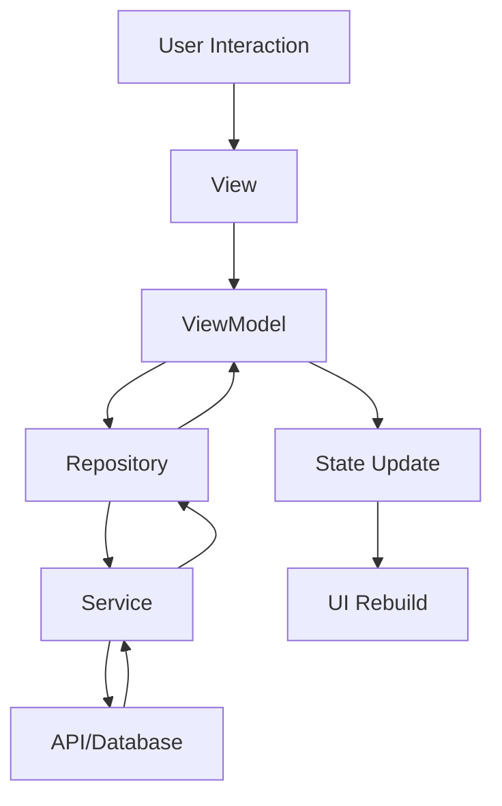

# Grid Practice - Flutter MVVM Architecture Project

A comprehensive Flutter project demonstrating **MVVM (Model-View-ViewModel)** architecture implementation with clean code principles and best practices.

## 🎯 Project Overview

This repository contains a Flutter application built with modern architectural patterns, focusing on:

- **Clean Architecture**: Separation of concerns across different layers
- **MVVM Pattern**: Model-View-ViewModel architecture for better code organization
- **State Management**: Using Provider for reactive state management
- **Scalable Structure**: Organized folder structure for large-scale applications
- **Best Practices**: Following Flutter and Dart coding standards

## 📱 Application Features

- **Home Screen**: Demonstrates MVVM pattern implementation
- **State Management**: Reactive UI updates using Provider
- **API Integration**: HTTP service layer for external data
- **Clean UI**: Material Design components with custom theming
- **Error Handling**: Centralized error management across the app

## 🏗️ Architecture

```
┌─────────────────────────────────────────────────┐
│                   VIEW LAYER                    │
│        (UI Components & Screens)                │
├─────────────────────────────────────────────────┤
│                VIEWMODEL LAYER                  │
│         (Business Logic & State)                │
├─────────────────────────────────────────────────┤
│                 MODEL LAYER                     │
│             (Data Entities)                     │
├─────────────────────────────────────────────────┤
│               REPOSITORY LAYER                  │
│            (Data Access Logic)                  │
├─────────────────────────────────────────────────┤
│                SERVICE LAYER                    │
│          (External APIs & Services)             │
└─────────────────────────────────────────────────┘
```

## 📁 Project Structure

```
gridPractice/
├── app/                           # Main Flutter Application
│   ├── lib/
│   │   ├── src/
│   │   │   ├── models/           # 📋 Data Models & Entities
│   │   │   ├── views/            # 🎨 UI Components
│   │   │   │   ├── screens/      # Application screens
│   │   │   │   └── widgets/      # Reusable widgets
│   │   │   ├── viewmodels/       # 🧠 Business Logic
│   │   │   ├── repositories/     # 📚 Data Access Layer
│   │   │   ├── services/         # 🌐 External Services
│   │   │   └── utils/            # 🛠️ Utilities & Constants
│   │   │       └── constants/
│   │   ├── main.dart            # Application entry point
│   │   └── src/app.dart         # Main app widget
│   ├── pubspec.yaml             # Dependencies & configuration
│   ├── README.md                # Detailed app documentation
│   └── test/                    # Unit & widget tests
└── README.md                    # This file
```

## 🚀 Getting Started

### Prerequisites

- **Flutter SDK**: Version 3.5.0 or higher
- **Dart SDK**: Included with Flutter
- **IDE**: Android Studio, VS Code, or IntelliJ with Flutter plugins
- **Device/Emulator**: Android/iOS device or emulator for testing

### Quick Start

1. **Clone the repository**
   ```bash
   git clone <repository-url>
   cd gridPractice
   ```

2. **Navigate to the app directory**
   ```bash
   cd app
   ```

3. **Install dependencies**
   ```bash
   flutter pub get
   ```

4. **Run the application**
   ```bash
   flutter run
   ```

## 📦 Dependencies

### Core Dependencies
- **flutter**: SDK framework
- **provider**: ^6.1.2 - State management solution
- **http**: ^1.1.0 - HTTP client for API calls
- **cupertino_icons**: ^1.0.8 - iOS-style icons

### Development Dependencies
- **flutter_test**: Testing framework
- **flutter_lints**: Code analysis and linting rules

## 🔧 Development

### Code Organization Principles

1. **Separation of Concerns**: Each layer has a specific responsibility
2. **Dependency Injection**: Dependencies are injected rather than created
3. **Reactive Programming**: UI automatically updates when data changes
4. **Clean Code**: Readable, maintainable, and well-documented code
5. **Testing**: Each layer can be tested independently

### Adding New Features

The MVVM architecture makes it easy to add new features:

1. **Define the Model** - Create data structures
2. **Implement Repository** - Handle data access
3. **Create ViewModel** - Add business logic
4. **Build the View** - Create UI components
5. **Wire Everything** - Connect using Provider

### State Management Flow



## 🧪 Testing Strategy

- **Unit Tests**: Test ViewModels and business logic
- **Widget Tests**: Test individual UI components
- **Integration Tests**: Test complete user flows
- **Repository Tests**: Test data access logic
- **Service Tests**: Test API integrations

## 📈 Benefits

### MVVM Architecture Benefits
- **Maintainability**: Easy to modify and extend
- **Testability**: Each component can be tested independently
- **Reusability**: ViewModels can be reused across different views
- **Separation**: Clear boundaries between UI and business logic

### Flutter Benefits
- **Cross-Platform**: Single codebase for iOS and Android
- **Performance**: Native performance with smooth animations
- **Hot Reload**: Fast development cycle
- **Rich Ecosystem**: Vast collection of packages and plugins

## 🔄 Data Flow

1. **User Action**: User interacts with the UI
2. **View**: Captures user input and calls ViewModel
3. **ViewModel**: Processes business logic and calls Repository
4. **Repository**: Handles data operations via Service
5. **Service**: Makes API calls or database operations
6. **Response**: Data flows back through the layers
7. **State Update**: ViewModel updates state and notifies listeners
8. **UI Update**: View rebuilds automatically via Provider

## 📚 Learning Resources

### Flutter Resources
- [Flutter Documentation](https://docs.flutter.dev/)
- [Flutter Samples](https://flutter.github.io/samples/)
- [Dart Language Tour](https://dart.dev/guides/language/language-tour)

### Architecture Resources
- [MVVM Pattern](https://docs.microsoft.com/en-us/xamarin/xamarin-forms/enterprise-application-patterns/mvvm)
- [Clean Architecture](https://blog.cleancoder.com/uncle-bob/2012/08/13/the-clean-architecture.html)
- [Provider Package](https://pub.dev/packages/provider)

## 🤝 Contributing

1. Fork the repository
2. Create a feature branch (`git checkout -b feature/amazing-feature`)
3. Commit your changes (`git commit -m 'Add some amazing feature'`)
4. Push to the branch (`git push origin feature/amazing-feature`)
5. Open a Pull Request

## 📄 License

This project is licensed under the MIT License - see the [LICENSE](LICENSE) file for details.

## 📞 Support

For questions, issues, or contributions:

- Create an issue in the repository
- Check the detailed documentation in `app/README.md`
- Review the code examples in the source files

---

**Happy Coding! 🚀**
